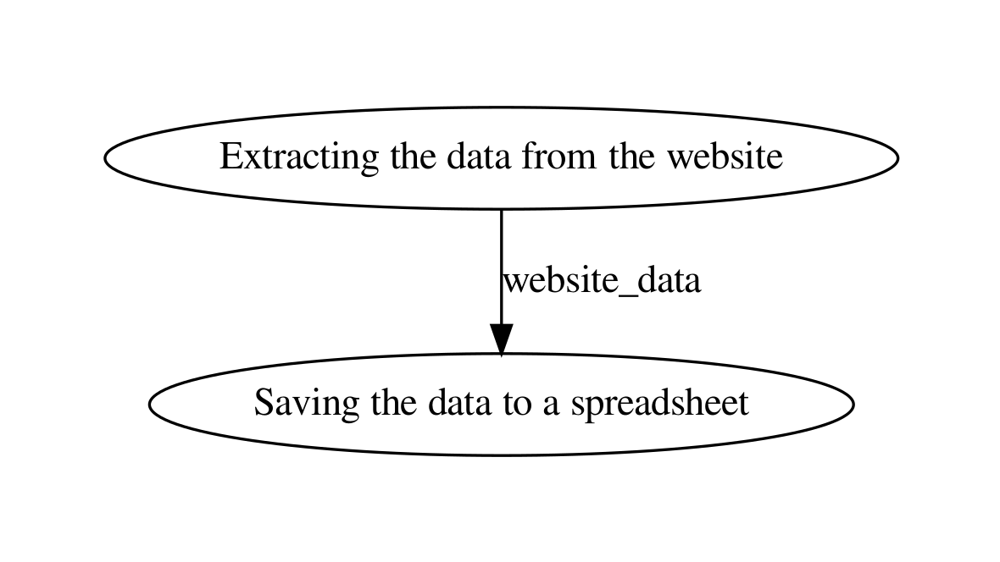

# Data Extraction Demo

<iframe class="video" src="https://www.youtube.com/embed/TUAQdP5Uoh4" frameborder="0" allow="accelerometer; autoplay; encrypted-media; gyroscope; picture-in-picture" allowfullscreen></iframe>

 

A simple workflow demo of data extraction using Python and Prefect.

This is an example of automating a process that involves downloading stock data from internet and saving it to a spreadsheet.

### Client Requirement
- Visit the financial website.
- Extract the stock information for GOOGLE
- Save the stock data in a spreadsheet.

### Flow

>** This is just a very simple demonstration of how a data extraction process can be automated. **

>** It doesn't matter if your process is as simple as this one or complex with many unsure steps & calculations, it can be automated. **
