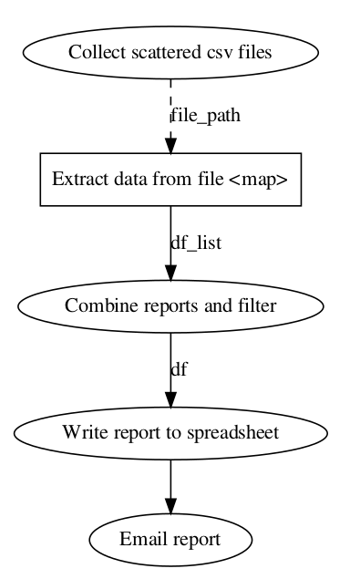

# Simple Workflow Demo

<iframe class="video" src="https://www.youtube.com/embed/S0fhK6X7iPY" frameborder="0" allow="accelerometer; autoplay; encrypted-media; gyroscope; picture-in-picture" allowfullscreen></iframe>

 

A simple workflow demo of report generation using `Python` and `Prefect`.

This is an example of automating a process of combining 100 comma separated files,  generating a single spreadsheet while filtering over Country and sending the generated report over email

### Requirement

- 100 comma separated files scattered in a directory
- Combine all reports
- Filter by given Country
- Send report via email

### Flow

>** This is a very straight forward and simple example for basic understanding of how a process can be automated. **

>** It doesn't matter if your process is as simple as this one or complex with many unsure steps, it can be automated. **
